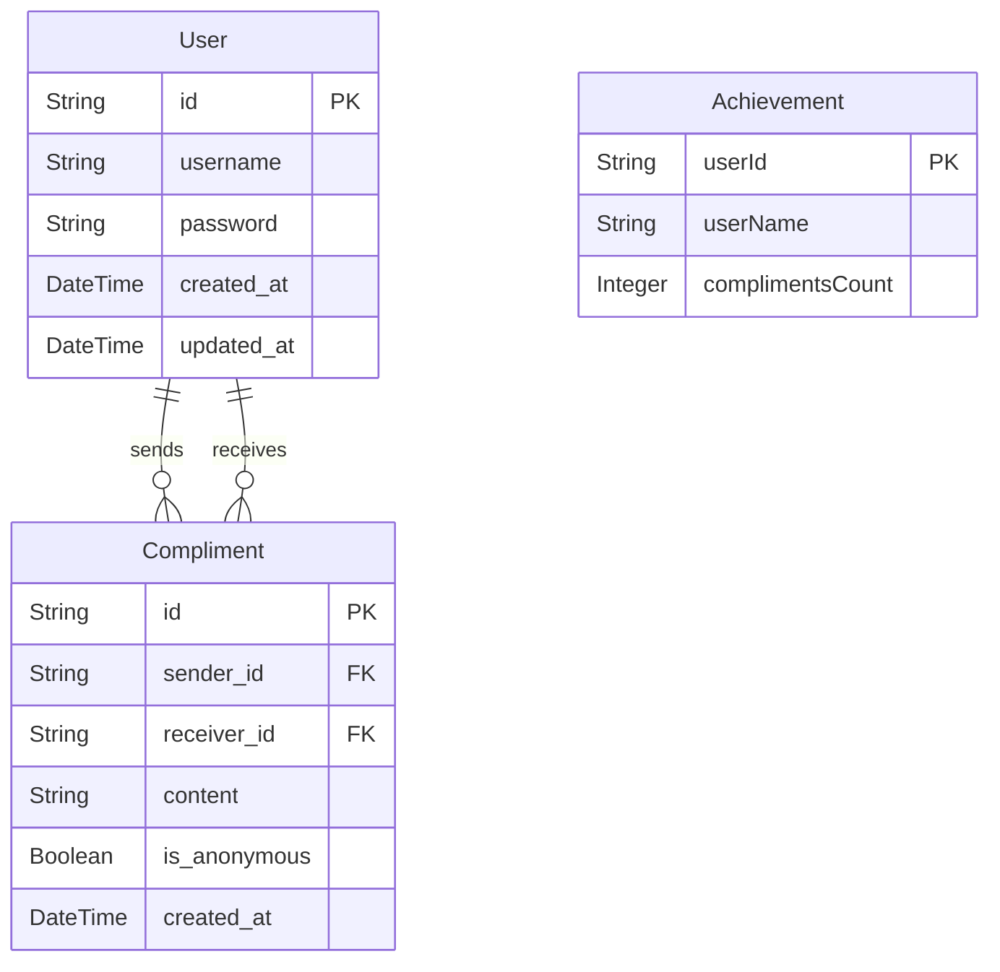

<div align="center">
<h2>ComplimentHub (Backend)</h2>
같은 구성원끼리 칭찬을 주고 받을 수 있는 칭찬의 장입니다. </br></br>

프로젝트 기간: 2024.09.01-2024.09.27
</div>

## 목차
- [개발환경](#개발환경)
- [주요 개발 사항](#주요-개발-사항)
- [도메인](#도메인)
- [엔드포인트](#엔드포인트)

## 개발 환경
- 


- JAVA 17, SpringBoot, Gradle, Docker, InteliJ 


## 주요 개발 사항
- MVC 패턴 설계
- Restful한 API 설계
- JWT 적용

## 도메인

### User
User는 Compliment Hub의 핵심 엔티티로, 서비스를 이용하는 개인을 나타냅니다. 각 사용자는 고유한 id를 가지고 있으며, 회원가입 시 제공한 username과 password를 통해 인증을 수행합니다. 사용자 계정이 생성된 시간(created_at)과 마지막으로 수정된 시간(updated_at)을 추적하여 사용자 정보의 변동 내역을 관리합니다.

### Compliment
Compliment는 Compliment Hub에서 사용자 간에 주고받는 칭찬을 나타냅니다. 칭찬은 특정한 sender_id(보낸 사람)와 receiver_id(받은 사람)를 통해 연결되며, 칭찬의 내용(content)과 익명 여부(is_anonymous)를 포함합니다. 또한, 칭찬이 전달된 시간(created_at)을 기록하여 히스토리를 추적합니다.

### Achievement
Achievement는 사용자가 받은 칭찬의 누적 결과를 나타내며, 사용자가 Compliment Hub에서 달성한 업적을 기록합니다. 업적 데이터는 사용자의 고유 ID(userId)와 이름(userName), 그리고 해당 사용자가 받은 칭찬의 총 개수(complimentsCount)를 포함합니다. 이를 통해 사용자가 얼마나 많은 칭찬을 받았는지 쉽게 확인할 수 있습니다.

### ERD


## 엔드포인트
/achievements

칭찬과 관련된 사용자의 업적을 조회하는 엔드포인트입니다.

	• GET /monthly-senders
	    • 월별로 가장 많은 칭찬을 보낸 사용자 목록을 반환합니다.
	• GET /monthly-receivers
	    • 월별로 가장 많은 칭찬을 받은 사용자 목록을 반환합니다.

/compliments

사용자 간의 칭찬을 주고받고 조회하는 엔드포인트입니다.

	• POST
	    • 새로운 칭찬을 생성하여 특정 사용자에게 전송합니다.
	• GET
	    • 사용자가 받은 칭찬을 조회합니다. 필터링 기능으로 특정 사용자로부터 받은 칭찬을 검색할 수 있습니다.

/users

사용자 정보 관리 및 인증 관련 엔드포인트입니다.

	• GET
	    • 전체 사용자 목록을 조회합니다.
	• GET /{userId}
	    • 특정 사용자의 정보를 조회합니다.
	• GET /check-id
	    • 특정 사용자 ID가 이미 존재하는지 확인합니다.
	• POST /login
	    • 로그인하여 JWT 토큰을 발급받습니다.
	• POST /sign-up
	    • 새로운 사용자 계정을 생성합니다.

## API 사용 예시
### 특정 유저 조회
Request:
```
GET users/{userId}
```
Response:
```json
{
    "status" : "200",
    "message" : "OK",
    "data" : {
        "name":"두루미"
    }
}
```

### 전체 칭찬 목록 조회
Request:
```
GET compliments
```
Response:
```json
{
    "status": "200",
    "message": "OK",
    "data": {
        "compliments": [
            {
                "id": "ed6e360c-98f3-4bc9-8c64-9070b39e0f57",
                "content": "칭찬합니다",
                "createAt": "2024-09-28",
                "sender": {
                    "id": "comp",
                    "name": "김도팔"
                },
                "receiver": {
                    "id": "123aab",
                    "name": "김덕팔"
                },
                "anonymous": false
            }
        ]
    }
}
```